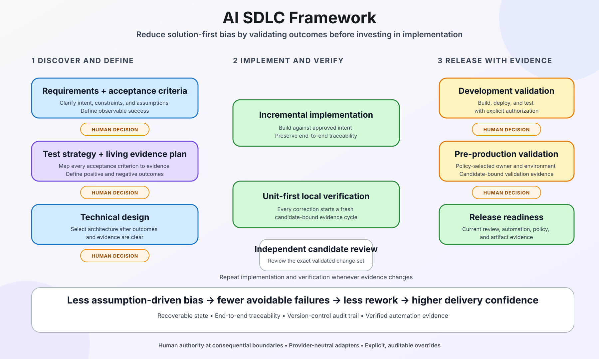

# AI SDLC Framework

A user-governed, AI-oriented Software Development Life Cycle for GitHub Copilot
CLI. It reduces solution-first bias by requiring understood requirements,
requirement-specific definitions of done, planned evidence, and an approved
technical design before implementation begins.



The framework combines installable Copilot instructions and skills with an
offline, dependency-free Node.js CLI. The agent handles reasoning and uses its
authorized tools; the local CLI records lifecycle state, user decisions,
candidate identity, test evidence, recovery information, and policy results.
Humans retain final authority at every consequential boundary.

## Why this project exists

AI coding agents are naturally good at proposing solutions quickly. That speed
can create rework when intent, acceptance conditions, test strategy, operational
constraints, or user authority are still unclear.

The common failure mode is not that the generated code is syntactically poor.
It is that the agent confidently optimizes for an incomplete interpretation:
the first plausible architecture, the easiest test, the most familiar
technology, or a successful build that does not prove the requested outcome.
Fast implementation then amplifies an early assumption.

This framework changes the default sequence:

1. Define the right outcome and its observable Definition of Done.
2. Design the evidence that will prove each requirement.
3. Design the solution only after the tests and constraints are understood.
4. Implement with a unit-first local feedback loop.
5. Review the exact candidate before publication or remote validation.
6. Promote through DEV, Staging, and PROD readiness only with explicit user
   authority and current evidence.

## How the framework reduces bias and suboptimal results

The framework does not claim that one lifecycle is universally correct. It
changes the default reasoning order and keeps assumptions, evidence, and user
authority visible:

- **Outcome before implementation.** Requirement-specific acceptance conditions
  force the agent to distinguish the requested result from its first solution
  idea.
- **Evidence before architecture.** Test Design asks how each outcome can be
  disproved or confirmed before Technical Design selects components.
- **Multiple authoritative artifacts.** Requirements, Test Plans, Technical
  Designs, repository instructions, provider facts, and source history remain
  distinct. One convenient document cannot silently replace another.
- **Explicit uncertainty.** Missing requirements, unsupported tools, unavailable
  environments, stale facts, and conflicting instructions remain visible rather
  than being converted into confident defaults.
- **Candidate-bound validation.** Test evidence, Review, artifacts, deployments,
  and PR checks are tied to exact source, configuration, and Test Plan identity.
  A changed candidate invalidates stale confidence.
- **Unit-first correction loop.** Every implementation fix restarts local
  evidence from the smallest required tests before broader checks.
- **Independent candidate Review.** The validated candidate receives a separate
  `/review` pass before its first publication or remote validation.
- **Provider adapters instead of guessed equivalence.** Generic lifecycle
  concepts are translated through concrete provider contracts, reducing
  provider-field guessing and rejecting observations or run links whose
  identities do not match.
- **Human-governed boundaries.** The user approves consequential transitions
  and may explicitly override any lifecycle recommendation. Overrides remain
  visible and cannot manufacture external permission or passing evidence.
- **Recovery without narrative invention.** Durable identities, bounded records,
  and reconciliation restore what is proven after interruption without asking
  the model to reconstruct history from memory.

The intended result is not more ceremony. It is fewer expensive iterations
caused by solving the wrong problem, testing the wrong thing, or promoting stale
evidence.

## Core behavior

- **Requirements before solutions.** Every distinct requirement receives a
  stable ID and its own observable acceptance conditions.
- **One living Test Plan.** Test Design evolves into the Test Plan, mapping
  requirements to automated, semi-automated, or manual evidence.
- **Approved Technical Design.** Components, contracts, failure behavior,
  compatibility, security boundaries, and operations are designed before code.
- **Focused engineering instructions.** Dedicated knowledge, coding, testing,
  building, and reviewing guides apply best-of-breed reusable practices while
  compatible repository instructions remain authoritative.
- **Unit-first after every fix.** Candidate-changing fixes reset local evidence
  and restart the required local suite from unit tests.
- **Built-in candidate Review.** GitHub Copilot CLI `/review` is required after
  pre-Review local validation. A changed candidate invalidates the prior Review.
- **Separate remote authority.** Local success does not trigger DEV. DEV, STAGING,
  PR publication, merge, policy bypass, and PROD execution remain distinct.
- **Deployment-bound evidence.** Artifacts, deployments, tests, PR checks, and
  environment completion are tied to exact candidates and run identities.
- **Recoverable workflow.** Thin local checkpoints, immutable records, Git audit
  trailers, and operation reconciliation allow interrupted work to resume.
- **Scoped overrides.** Users may explicitly override framework guardrails, but
  an override cannot invent external permission or turn missing evidence into a
  passing result.
- **Advisory lifecycle stages.** Requirements, Test Design, Technical Design,
  Coding, Review, orientation, and stage progression may be explicitly
  overridden by the user after at most one warning. Other findings make an
  action unmanaged/uncredited, but the framework hook never vetoes it; real
  enforcement remains with Copilot and host/external controls.

## Requirements

- Node.js 22 or later
- Git
- npm, included with Node.js
- GitHub Copilot CLI with the documented instructions, skills, and hooks
  extension points

The installed framework has no runtime package dependencies and no
cloud-provider network client. Provider operations remain owned by Copilot's authorized
tools.

## Install from npm

The public npm package is the primary distribution. The same command works in
macOS/Linux shells, Windows PowerShell, and Windows Command Prompt:

```sh
npx --yes --registry=https://registry.npmjs.org --package=ai-sdlc-framework@latest sdlc install
```

For acceptance testing of the current release, pin the exact version used by
the [Azure DevOps acceptance test](docs/ado-acceptance-test.md):

```sh
npx --yes --registry=https://registry.npmjs.org --package=ai-sdlc-framework@0.3.0 sdlc install --purge-existing
node "<COPILOT_HOME>/sdlc/bin/sdlc.mjs" doctor --home "<COPILOT_HOME>"
```

This downloads the package to npm's cache and installs the managed instructions,
skills, hooks, CLI, templates, and ownership manifest into `COPILOT_HOME`, or
`~/.copilot` when that variable is unset. To select another Copilot home, append
`--home "/path/to/copilot home"`.

Run the package doctor after installation:

```sh
npx --yes --registry=https://registry.npmjs.org --package=ai-sdlc-framework@latest sdlc doctor
```

It should report `"installed": true` with an empty `findings` array. Restart
Copilot CLI after installation because active processes do not hot-reload hooks,
instructions, or skills.

### Clean migration from the private or an earlier installation

Close every Copilot CLI process first. This single cross-platform command
irreversibly removes the prior framework's owned files and runtime state, then
installs the new npm package:

```sh
npx --yes --registry=https://registry.npmjs.org --package=ai-sdlc-framework@latest sdlc install --purge-existing
```

The command removes modified framework-owned files, work items, decisions,
evidence, manifests, and locks. It preserves unrelated Copilot files and
unrelated content in `copilot-instructions.md`. npm's package cache is outside
`COPILOT_HOME`, so the new executable remains available throughout replacement.
Run `doctor` afterward and restart Copilot CLI.

### Offline `.tgz` fallback

Each GitHub Release also includes
`ai-sdlc-framework-<version>.tgz` for offline or controlled distribution.
Extract it into a directory outside `COPILOT_HOME` and invoke its
`bin/sdlc.mjs install` or `install --purge-existing` command with Node.js. The
release pipeline verifies the archive digest and inventory before publication.

For a repository on a UNC share, use PowerShell or a direct argument-array tool.
The current `cmd.exe` adapter reports this cwd combination as unavailable and
does not credit it as managed execution. The hook still falls through; it does
not claim that cmd retained the requested directory.

## Install from a source checkout

```sh
git clone https://github.com/urmich/ai-sdlc-framework.git ai-sdlc-framework
cd ai-sdlc-framework

COPILOT_HOME="${COPILOT_HOME:-$HOME/.copilot}"

npm run check
npm test

node bin/sdlc.mjs install --home "$COPILOT_HOME"
node "$COPILOT_HOME/sdlc/bin/sdlc.mjs" doctor --home "$COPILOT_HOME"
```

## Update the framework

Close active development work first. The update preserves runtime workflow
state, but Copilot must be restarted afterward because the running process keeps
the old hooks and instructions in memory.

If an active v1.2.0/v1.2.1 hook blocks the update, run the applicable commands
below in a normal terminal outside that Copilot session.

### Update on macOS or Linux

```sh
VERSION="0.3.0"
DOWNLOAD_DIR="$HOME/Downloads/ai-sdlc-framework-$VERSION"
PACKAGE_ROOT="$HOME/.local/share/ai-sdlc-framework/$VERSION"
COPILOT_HOME="${COPILOT_HOME:-$HOME/.copilot}"
PACKAGE="$DOWNLOAD_DIR/ai-sdlc-framework-$VERSION.tgz"

mkdir -p "$DOWNLOAD_DIR" "$PACKAGE_ROOT"

gh release download "v$VERSION" \
  --repo urmich/ai-sdlc-framework \
  --pattern "ai-sdlc-framework-$VERSION.tgz" \
  --clobber \
  --dir "$DOWNLOAD_DIR"

npm install \
  --ignore-scripts \
  --no-audit \
  --no-fund \
  --bin-links=false \
  --prefix "$PACKAGE_ROOT" \
  "$PACKAGE"

SOURCE_ROOT="$PACKAGE_ROOT/node_modules/ai-sdlc-framework"

node "$COPILOT_HOME/sdlc/bin/sdlc.mjs" \
  update --home "$COPILOT_HOME" --source-root "$SOURCE_ROOT"

node "$COPILOT_HOME/sdlc/bin/sdlc.mjs" \
  doctor --home "$COPILOT_HOME"
```

### Update on Windows PowerShell

```powershell
$Version = "0.3.0"
$DownloadDir = Join-Path $HOME "Downloads\ai-sdlc-framework-$Version"
$PackageRoot = Join-Path $env:LOCALAPPDATA "ai-sdlc-framework\$Version"
$CopilotHome = if ($env:COPILOT_HOME) {
  $env:COPILOT_HOME
} else {
  Join-Path $HOME ".copilot"
}
$Package = Join-Path $DownloadDir "ai-sdlc-framework-$Version.tgz"
$SourceRoot = Join-Path $PackageRoot "node_modules\ai-sdlc-framework"

New-Item -ItemType Directory -Force -Path $DownloadDir, $PackageRoot | Out-Null

gh release download "v$Version" `
  --repo urmich/ai-sdlc-framework `
  --pattern "ai-sdlc-framework-$Version.tgz" `
  --clobber `
  --dir "$DownloadDir"

npm install `
  --ignore-scripts `
  --no-audit `
  --no-fund `
  --bin-links=false `
  --prefix "$PackageRoot" `
  "$Package"

node (Join-Path $CopilotHome "sdlc\bin\sdlc.mjs") `
  update --home "$CopilotHome" --source-root "$SourceRoot"

node (Join-Path $CopilotHome "sdlc\bin\sdlc.mjs") `
  doctor --home "$CopilotHome"
```

### Update on Windows Command Prompt

```bat
set "VERSION=0.3.0"
set "DOWNLOAD_DIR=%USERPROFILE%\Downloads\ai-sdlc-framework-%VERSION%"
set "PACKAGE_ROOT=%LOCALAPPDATA%\ai-sdlc-framework\%VERSION%"
if defined COPILOT_HOME (set "FRAMEWORK_HOME=%COPILOT_HOME%") else (set "FRAMEWORK_HOME=%USERPROFILE%\.copilot")
set "PACKAGE=%DOWNLOAD_DIR%\ai-sdlc-framework-%VERSION%.tgz"
set "SOURCE_ROOT=%PACKAGE_ROOT%\node_modules\ai-sdlc-framework"

mkdir "%DOWNLOAD_DIR%" 2>nul
mkdir "%PACKAGE_ROOT%" 2>nul

gh release download "v%VERSION%" --repo urmich/ai-sdlc-framework --pattern "ai-sdlc-framework-%VERSION%.tgz" --clobber --dir "%DOWNLOAD_DIR%"

npm install --ignore-scripts --no-audit --no-fund --bin-links=false --prefix "%PACKAGE_ROOT%" "%PACKAGE%"

node "%FRAMEWORK_HOME%\sdlc\bin\sdlc.mjs" update --home "%FRAMEWORK_HOME%" --source-root "%SOURCE_ROOT%"
node "%FRAMEWORK_HOME%\sdlc\bin\sdlc.mjs" doctor --home "%FRAMEWORK_HOME%"
```

After a successful update, verify that `doctor` reports the new
`frameworkVersion`, `"installed": true`, and an empty `findings` array. Then
close and restart Copilot CLI.

## Uninstall the framework

Uninstall removes unchanged framework-owned instructions, skills, hooks, and
CLI files. It preserves modified/unowned files and always retains
`<COPILOT_HOME>/sdlc/runtime/` so active workflow evidence can be recovered.
The separately extracted package directory is not removed.

### Uninstall on macOS or Linux

```sh
COPILOT_HOME="${COPILOT_HOME:-$HOME/.copilot}"

node "$COPILOT_HOME/sdlc/bin/sdlc.mjs" \
  uninstall --home "$COPILOT_HOME"
```

### Uninstall on Windows PowerShell

```powershell
$CopilotHome = if ($env:COPILOT_HOME) {
  $env:COPILOT_HOME
} else {
  Join-Path $HOME ".copilot"
}

node (Join-Path $CopilotHome "sdlc\bin\sdlc.mjs") `
  uninstall --home "$CopilotHome"
```

### Uninstall on Windows Command Prompt

```bat
if defined COPILOT_HOME (set "FRAMEWORK_HOME=%COPILOT_HOME%") else (set "FRAMEWORK_HOME=%USERPROFILE%\.copilot")

node "%FRAMEWORK_HOME%\sdlc\bin\sdlc.mjs" uninstall --home "%FRAMEWORK_HOME%"
```

Review the uninstall result. `"uninstalled": true` means all unchanged owned
content was removed. A nonempty `preserved` array identifies modified files that
were intentionally left in place.

## What gets installed

```text
<copilot-home>/
  copilot-instructions.md        # framework-owned delimited block
  hooks/sdlc.json
  skills/sdlc/SKILL.md
  skills/sdlc-requirements/SKILL.md
  skills/sdlc-test-design/SKILL.md
  skills/sdlc-technical-design/SKILL.md
  skills/sdlc-coding/SKILL.md
  sdlc/bin/sdlc.mjs
  sdlc/instructions/knowledge-retrieval.md
  sdlc/instructions/coding.md
  sdlc/instructions/testing.md
  sdlc/instructions/building.md
  sdlc/instructions/reviewing.md
  sdlc/src/
  sdlc/templates/
  sdlc/cli.md
  sdlc/install-manifest.json
  sdlc/runtime/                  # local state and evidence references
```

## Using the framework

After restarting Copilot CLI, make an ordinary development request. You do not
need to name the framework. The installed instructions classify development
intent and begin or recover the appropriate work item.

For a new development request, Copilot should naturally begin with the
equivalent of “Let’s first gather and confirm the requirements,” then immediately
read the relevant source, contribution guidance, tickets, or other inputs.
Requests such as “build this end-to-end,” “create the PR,” “ASAP,” or “go” do not
mean “skip the framework.” At each transition Copilot explains the next stage's
value once—for example, the Test Plan provides the quality gate. You may reject
or override any stage at any time; Copilot should acknowledge that choice and
proceed without repeating the argument.

Copilot may start in a parent directory that is not a Git repository. The
framework allows safe discovery plus captured-request Git clone/init and branch
bootstrap, then binds the actual repository through `sdlc init --cwd`. It does
not require restarting Copilot solely to move the session root; later managed
edits receive trusted lifecycle credit only for the explicitly bound repository.

Typical lifecycle:

```text
Requirements
  -> user approval
Test Design / living Test Plan
  -> user approval
Technical Design
  -> user approval
Coding <-> unit-first local validation
  -> GitHub Copilot CLI /review
  -> user confirms Review and separately authorizes publication or DEV
DEV build -> deploy -> test
  -> user confirms DEV and authorizes STAGING
Staging deployment -> policy-owned validation at an authorized location
  -> user confirms STAGING
PROD readiness recommendation
```

The framework stores portable work-item metadata under
`.sdlc/work-items/<id>.json` in the coordinator repository and machine-local
runtime records under `<COPILOT_HOME>/sdlc/runtime/`.

Use:

```sh
COPILOT_HOME="${COPILOT_HOME:-$HOME/.copilot}"

node "$COPILOT_HOME/sdlc/bin/sdlc.mjs" status \
  --home "$COPILOT_HOME" \
  --cwd "/path/to/repository" \
  --work-item "work-item-id"

node "$COPILOT_HOME/sdlc/bin/sdlc.mjs" check all \
  --home "$COPILOT_HOME" \
  --cwd "/path/to/repository" \
  --work-item "work-item-id"
```

See [Installation and CLI reference](docs/cli.md) for all structured commands,
input schemas, evidence rules, operation handling, recovery, and limits.

## Calculator framework dry run

`test/calculator/` contains a dependency-free browser calculator developed
through the installed framework:

- [Requirements](test/calculator/docs/requirements.md)
- [Test Plan](test/calculator/docs/test-plan.md)
- [Technical Design](test/calculator/docs/technical-design.md)
- [Framework assessment](test/calculator/docs/framework-assessment.md)
- [Browser application](test/calculator/index.html)

The exercise demonstrated that receipt provenance, planned artifact locators,
snapshot-bound phase approvals, unit-first cycle resets, candidate Review,
browser acceptance, Git auditing, and exact push authorization all worked.
It also showed that Review and initial automated tests were insufficient by
themselves: user browser testing found additional defects, which were added to
the living Test Plan and fixed through new validation cycles.

Run its tests with:

```sh
node --test test/calculator/test/calculator.test.js
node --test test/calculator/test/*.test.js
```

Open `test/calculator/index.html` directly or serve it locally:

```sh
python3 -m http.server 8765 --directory test/calculator
```

Then browse to http://127.0.0.1:8765/.

## Build and CI/CD

```sh
npm run check
npm test
npm run package:artifact
npm run verify:package
```

Packaging creates:

```text
dist/ai-sdlc-framework-<version>.tgz
```

The package is built twice and must produce the same SHA-256 digest. Internal
verification rebuilds the expected package from the same source, compares its
digest and inventory with the distributable, then exercises install, doctor,
idempotent update, and uninstall in an isolated Copilot home.

`.github/workflows/ci.yml` validates pull requests, `main`, and manual runs.
The separate [release workflow](docs/release-ci.md) builds a frozen candidate on
version tags or manual dispatch. Mandatory gates are native macOS Apple Silicon
arm64 **standalone and Homebrew** lifecycle and deterministic Windows x64 cross-build/schema/payload/WinGet
metadata/pre-JS payload-integrity validation; native Windows is not claimed.
Published standalone archives are **Windows x64, macOS arm64 and macOS Intel x64**.
Intel archive reproducibility plus architecture-specific Homebrew URL/checksum
validation and real host Homebrew audit/style are mandatory non-execution
checks. Both macOS gates reject incorrect/missing Node runtime dependency metadata.
Intel native lifecycle remains
`NotRun` and non-blocking; Linux installer archives remain excluded.
Stable Homebrew metadata includes both macOS architectures.

Successful gates produce one immutable `release-bundle` artifact. Publication
requires explicit manual inputs and protected `release`/`npm` environments:
GitHub assets stay in a draft, and npm receives the identical verified `.tgz`.
Tag builds alone never publish. Configure the approved public asset repository,
runner access and npm trusted publishing before enabling those handoffs.
The protected npm job is data-only and tokenless: GitHub-hosted Node 24,
npm >=11.15, and OIDC with automatic public-repository provenance. npm trust
targets the actual caller **`release.yml`**, with environment **`npm`** on the
publishing job in reusable **`npm-publish.yml`**; both caller and called job
permit `id-token: write`.
Homebrew generation has an integration interface but no duplicated implementation.
Only after completed native validation can a sealed review bundle include the
candidate-bound T-60 Windows tester handoff. Missing Homebrew integration blocks
the native gate; pending T-60 content completeness blocks publication.

## Documentation

| Document | Purpose |
| --- | --- |
| [Design Overview](docs/design-overview.md) | Short human-readable workflow, architecture, decisions, and limitations |
| [Requirements](docs/requirements.md) | Formal framework requirements and requirement-specific definitions of done |
| [Test Design / Test Plan](docs/test-plan.md) | Living validation plan, execution checkpoints, and current evidence |
| [Technical Design](docs/technical-design.md) | Detailed implementation, state, authorization, recovery, and evidence contracts |
| [CLI reference](docs/cli.md) | Installation, commands, structured inputs, and operational behavior |
| [Provider adapter guide](docs/provider-adapters.md) | Generic execution identity, Azure DevOps adapter, and extension contract |
| [Azure DevOps acceptance test](docs/ado-acceptance-test.md) | Agent prompt and evidence checklist for a safe existing-repository handoff |
| [Release CI and acceptance](docs/release-ci.md) | Scoped gates, immutable bundle, draft/npm handoffs, and postpublication evidence |

## Repository organization

- `assets/`: installable global/focused instructions, skills, hooks, and templates
- `bin/`, `src/`: offline framework CLI and deterministic policy/runtime logic
- `docs/`: requirements, Test Plan, detailed design, and human overview
- `scripts/`: source checks and reproducible packaging tools
- `test/`: deterministic framework tests and the calculator dry run
- `.github/workflows/`: validation, scoped release candidates, and explicit live acceptance

## Current limits

- Hooks are advisory event handlers, not a security boundary.
- A Copilot session started before installation must be restarted before
  automatic hook and instruction activation can be verified.
- Live provider, scheduler, cloud-hosted DEV/STAGING, and production behavior requires
  actual authorized integrations; local fixtures do not prove those systems.
- Pipeline monitoring stops when its execution host stops.
- Git history cannot recover local facts that were never audited.

The framework is intentionally user-governed: explicit overrides remain
possible, but every deviation and every missing verification must stay visible.

## License

Released under the [MIT License](LICENSE).
